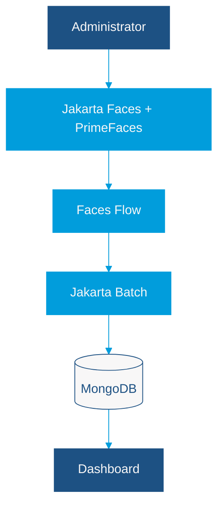
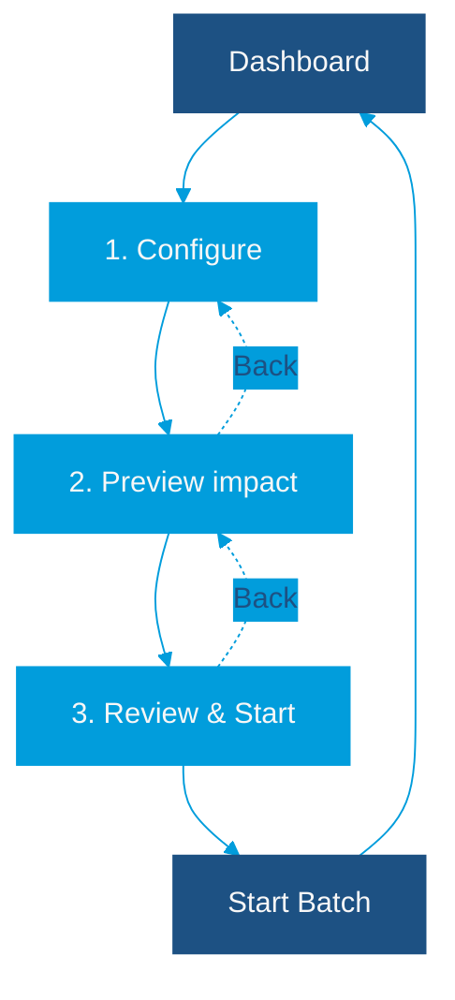
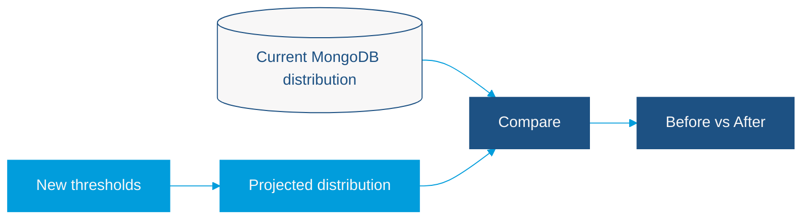
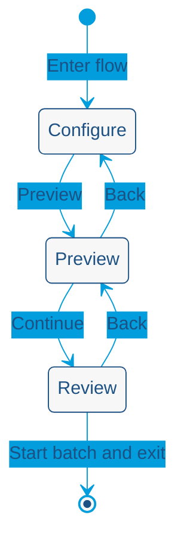
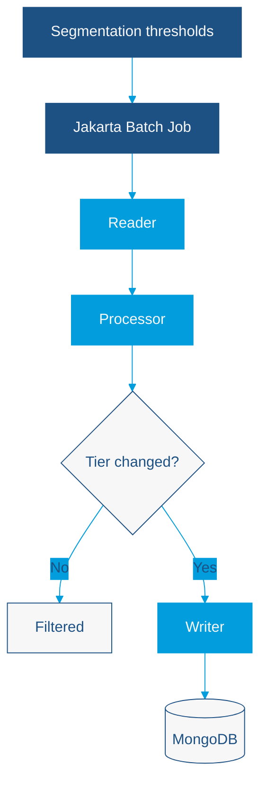
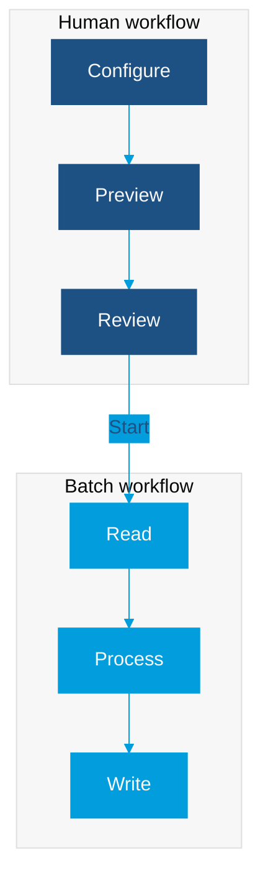
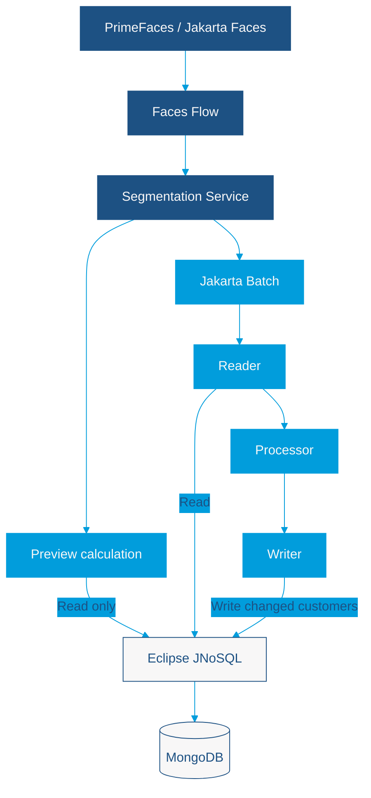

# E-Commerce Customer Segmentation

Customer spending changes, and the rules used to recognize valuable customers
change with it. This Jakarta EE sample demonstrates how an e-commerce
application can safely reclassify customers into **Bronze**, **Silver**,
**Gold**, and **Platinum** tiers while keeping administrators informed before
any data is changed.

The application combines Jakarta Faces Flow for the human decision process,
Jakarta Batch for background processing, and Eclipse JNoSQL with MongoDB for
persistence.

## The business problem

An e-commerce application classifies customers according to their accumulated
spending. Its default segmentation starts with these values:

| Tier | Minimum spending |
| --- | ---: |
| Bronze | €10 |
| Silver | €1,000 |
| Gold | €5,000 |
| Platinum | €10,000 |

These thresholds may change as the business evolves. When they do, the
application must:

- allow an administrator to define new values;
- show the expected impact before modifying data;
- process all affected customers;
- update only customers whose tier changed;
- avoid processing the full customer population inside an HTTP request.

## Application overview



The web layer collects the administrator's decision and starts the operation.
Jakarta Batch then owns the processing lifecycle independently of the HTTP
request.

## Customer segmentation flow

The user interface models segmentation as a three-step Jakarta Faces Flow:

1. **Configure**
2. **Preview impact**
3. **Review & Start**



### Step 1 — Configure

The administrator changes the minimum spending value for each customer tier.
This editable configuration is held in `@FlowScoped` state, so it remains
available throughout the multi-page interaction without becoming session-wide
state.

### Step 2 — Preview impact

Before changing any customer, the application calculates:

- the **current distribution**;
- the **projected distribution** under the edited thresholds;
- the expected **change per tier**.

| Tier | Current | Projected | Change |
| --- | ---: | ---: | ---: |
| Bronze | 30 | 22 | -8 |
| Silver | 30 | 35 | +5 |
| Gold | 25 | 27 | +2 |
| Platinum | 15 | 16 | +1 |

The current distribution comes from persisted MongoDB customer data. The
projected distribution applies the proposed thresholds to customer spending.
Preview is read-only: it neither changes customer tiers nor starts the batch.



### Step 3 — Review & Start

The administrator reviews the new threshold values, current and projected
distributions, and expected changes. Only after confirmation does the
application start the batch.

Starting the job ends the Faces Flow and redirects the browser to the
dashboard. Batch execution continues under the Jakarta Batch runtime rather
than keeping the web request open.

## Why FlowScoped?



`@FlowScoped` survives navigation across the Configure, Preview, and Review
views, then ends when the flow exits. The scope follows the business
conversation rather than the user session. This keeps temporary thresholds and
preview results together while preventing them from leaking into unrelated
pages or later interactions.

## Batch processing



The Reader supplies customers to the job. The Processor calculates each
customer's expected tier and filters unchanged customers from the output. The
Writer persists only the customers whose classification changed.

The job uses chunk-oriented processing with a configured chunk size of 20.

## Classification rule

A customer belongs to the tier with the highest minimum threshold that is less
than or equal to the customer's total spending.

```text
Bronze       10
Silver     1000
Gold       5000
Platinum  10000

Customer total spent: 7500
Result: Gold
```

The preview and the Jakarta Batch Processor reuse the same classification
rule. This prevents the application from previewing one result and executing a
different one.

## Human workflow vs batch workflow



These workflows have different lifecycles and responsibilities. The human
workflow supports decisions, validation, and navigation. The batch workflow
performs restartable, chunk-oriented data processing after that decision has
been made.

## How to run

### Prerequisites

- Java 21 or newer
- Maven
- MongoDB, either local or hosted in MongoDB Atlas

Build and verify the application:

```bash
mvn clean verify
```

Start the application with the Embedded GlassFish Maven plugin configured in
the project:

```bash
mvn embedded-glassfish:run
```

Open [http://localhost:8080/](http://localhost:8080/). The configured
application context root is `/`, and the Embedded GlassFish HTTP port is
`8080`.

## MongoDB local

The default configuration connects to `mongodb://localhost:27017` and uses the
`ecommerce` database. A local MongoDB 8 instance can be started with Docker:

```bash
docker run --name ecommerce-mongodb -p 27017:27017 -d mongo:8.0
```

Start MongoDB before running GlassFish. The defaults are declared in
`src/main/resources/META-INF/microprofile-config.properties`.

## MongoDB Atlas

MongoDB Atlas can replace the local MongoDB instance:

1. Create or select an Atlas deployment.
2. Create a database user.
3. Configure network access for the machine running the application.
4. Copy the MongoDB connection string.
5. Supply that URI to the application.

The project reads the URI from the `jnosql.mongodb.url` configuration key.
MicroProfile Config maps this key to the `JNOSQL_MONGODB_URL` environment
variable:

```bash
export JNOSQL_MONGODB_URL='mongodb+srv://<username>:<password>@<cluster-host>/?retryWrites=true&w=majority'
export JNOSQL_DOCUMENT_DATABASE='ecommerce'
mvn embedded-glassfish:run
```

Replace the placeholders with URL-encoded Atlas credentials and the actual
cluster host. The database key is `jnosql.document.database`; its default value
is `ecommerce`.

> **Never commit MongoDB Atlas credentials to Git.**

## Seed data

The application includes sample customer data for demonstration. When the
dashboard initializes, the seed is loaded only if no customer data already
exists. Existing data causes the import to be skipped, preventing duplicate
seed records.

After initialization, the dashboard presents the persisted customer
distribution.

## Dashboard

The home page shows:

- total customers;
- Bronze, Silver, Gold, and Platinum counts and percentages;
- a customer distribution chart;
- the latest batch execution status;
- whether a segmentation batch is currently running.

After the batch completes, refreshing the dashboard loads the new distribution
persisted in MongoDB.

## Architecture overview



The preview path reads customer data through Eclipse JNoSQL without modifying
it. The execution path passes the confirmed thresholds to Jakarta Batch, which
orchestrates reading, classification, filtering, and persistence.

## Notes about scale

This sample uses a small dataset to keep the architecture easy to understand.
The current Reader obtains all customers, sorts them, and materializes them in
memory before processing starts. That trade-off is acceptable for a
demonstration, but it is not intended to represent a production-scale MongoDB
reader.

For larger datasets, the Reader should evolve toward cursor- or page-based
access so that customers are fetched incrementally. The Jakarta Batch chunk
size controls how many processed items are committed together; MongoDB cursor
fetch size and write batch size are separate concerns and should be tuned
independently.

## Principles

- Human workflow and batch workflow have different lifecycles.
- Preview and execution must share the same business rule.
- Long-running work should not execute inside an HTTP request.
- Only changed customers should be written.
- `@FlowScoped` is useful for multi-step user interactions.
- MongoDB provides persistence, while Jakarta Batch owns processing
  orchestration.
